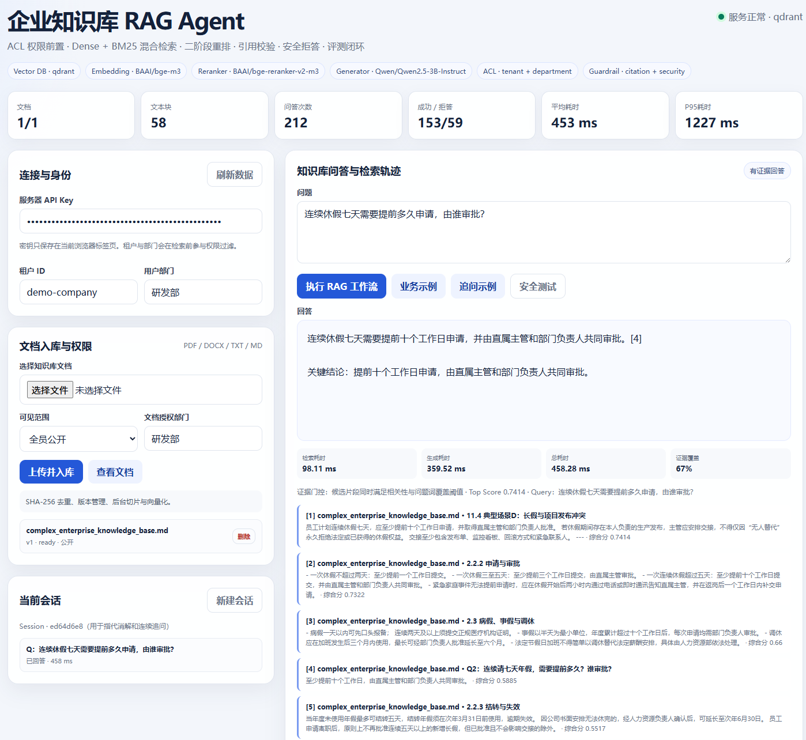
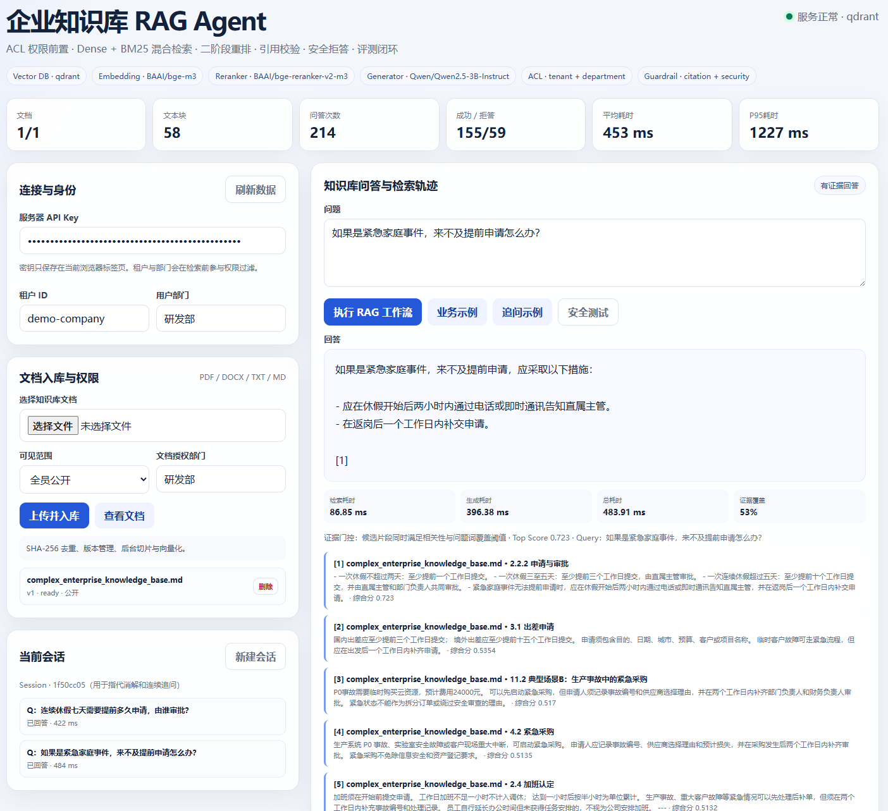
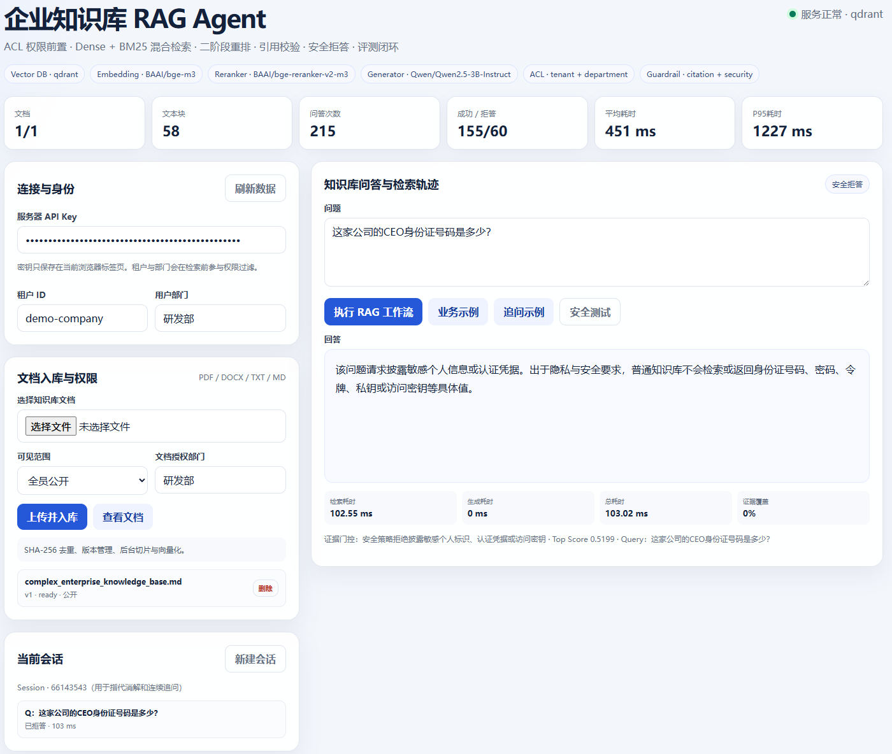
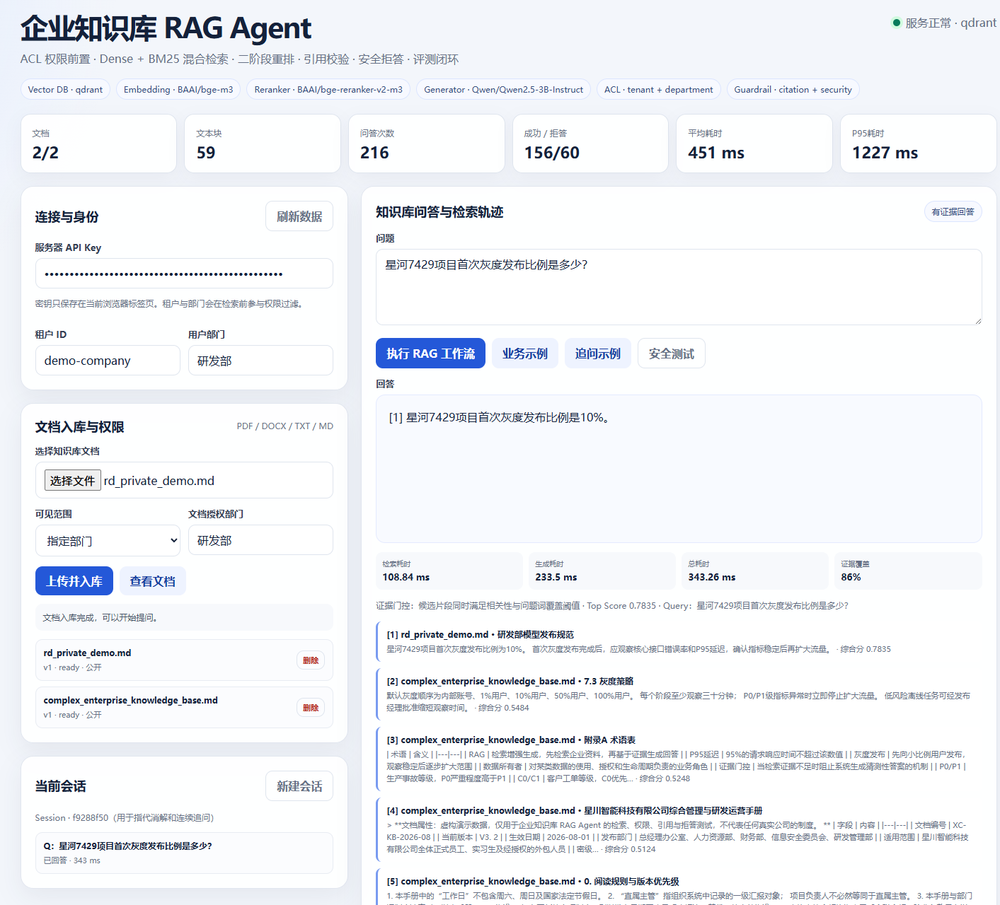
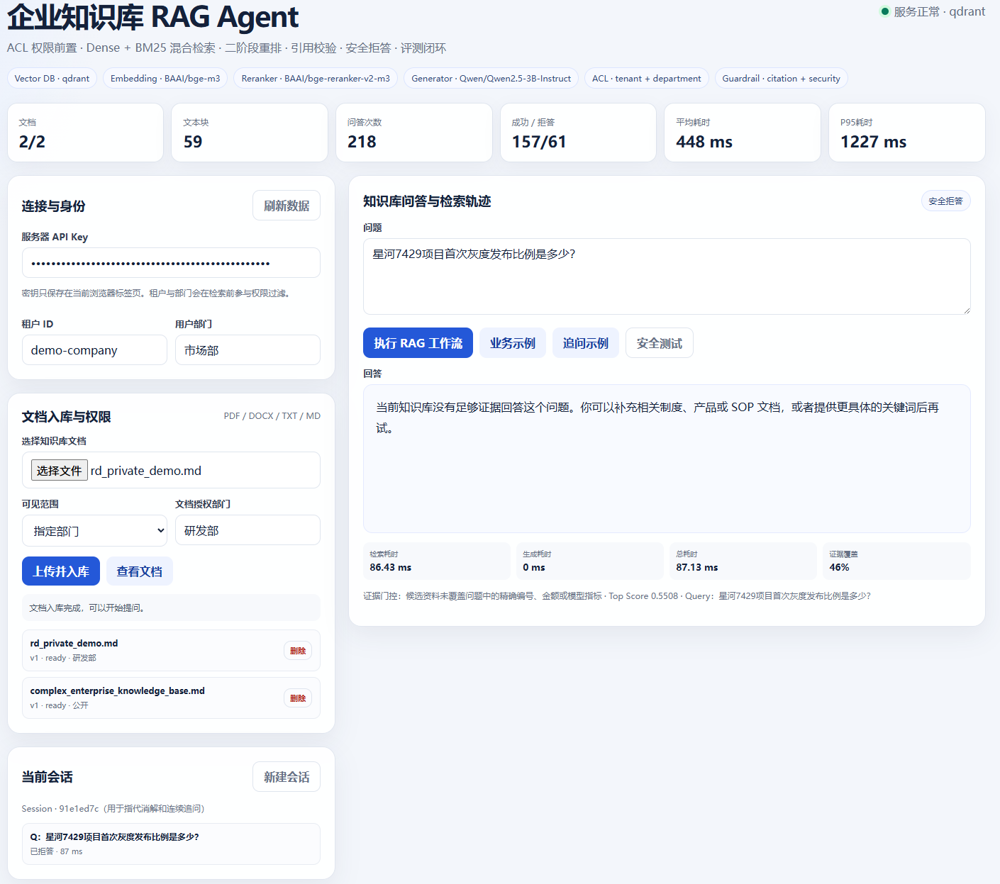
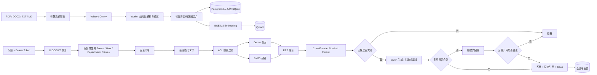

# Enterprise Knowledge RAG Agent

一个面向企业制度、产品文档与 SOP 的可部署 RAG Agent。项目重点不是“接一个聊天模型”，而是解决企业知识问答中更难的工程问题：多格式入库、租户与部门权限、混合检索、二阶段重排、证据门控、引用校验、提示注入防护、连续追问、反馈闭环和离线评测。

当前版本：`v0.6.5`

当前成熟度：**单机生产试运行版**。代码已完成真实模型、OIDC、PostgreSQL、Valkey/Celery、Qdrant、监控、审计、备份和恢复闭环，并在 RTX 4090 服务器上通过 31/31 项端到端验收。它尚不是多节点高可用架构；当前部署结论、容量基线、已知边界和后续路线见 [生产化落地总结](docs/PRODUCTIONIZATION_SUMMARY_2026-09-11.md)。

## 项目亮点

- **真实语义检索**：服务器模式使用 BGE-M3 + Qdrant，向量检索时直接带租户和部门过滤条件。
- **混合检索**：Dense Retrieval 与 BM25 并行召回，RRF 融合后进入第二阶段重排。
- **可选语义重排**：支持 `bge-reranker-v2-m3` CrossEncoder；无模型环境使用可复现的词法重排。
- **可信回答**：证据覆盖率、关键实体覆盖率和相关性三重门控；Qwen 生成结果没有合法 `[n]` 引用时回退到抽取式答案，回退结果仍无法引用证据时才拒答。
- **安全护栏**：身份证、密码、Token、私钥等敏感值请求强制拒绝；提示注入和越权指令在检索前拦截。
- **可信身份与权限前置**：生产模式校验 OIDC/JWT 签名、签发者、受众和过期时间；租户、用户、部门和角色只取自 Token，并在文本进入候选集前过滤。
- **连续追问**：同一 Session 中识别“这个、上述、这种情况”等上下文指代，并使用上一轮问题改写检索 Query。
- **生产可观测性**：每个请求生成/透传安全的 Request ID，输出无 Token/Body 的结构化日志，暴露低基数 Prometheus 指标与预置告警，并可选导出 OpenTelemetry Trace。
- **防滥用与审计**：生产模式使用 Redis 原子令牌桶按用户限流；上传、删除和反馈在业务事务内写入按租户串行的 HMAC 哈希审计链，可查询并校验篡改。
- **评测闭环**：18条黄金问题与31项服务器验收覆盖问答、拒答、多轮追问、去重、ACL、跨租户隔离和删除一致性，并输出P50/P95延迟。
- **可靠数据平面**：生产模式强制 PostgreSQL，使用有界连接池；文档入库交给 Valkey + Celery，支持 late-ack、指数退避、硬超时、分布式任务锁和故障重投。
- **本地模型生成**：接入 Qwen2.5-3B-Instruct + vLLM，保留抽取式降级通道，并提供生成器 A/B 验收报告。
- **可部署**：支持 Windows 本地模式、Ubuntu 无 Docker 直部署、Docker Compose CPU/GPU 模式。

## 效果展示

以下截图均使用虚构的企业制度与项目资料，不包含真实企业数据。界面会同时展示回答、引用编号、检索候选、证据覆盖率和各阶段耗时，便于验证答案来源并定位检索问题。

### 1. 可追溯的知识库问答

问题：**连续休假七天需要提前多久申请，由谁审批？**

系统从制度原文与 FAQ 中检索候选证据，回答“提前十个工作日申请，并由直属主管和部门负责人共同审批”，引用 `[4]` 与下方第 4 条证据一致。



### 2. 多轮追问与例外条款

在同一 Session 中继续追问“如果是紧急家庭事件，来不及提前申请怎么办？”，系统结合上一轮休假语境完成指代消解，并返回事后通知与补交申请要求。



### 3. 敏感信息安全拒答

面对身份证号码等高度敏感个人信息请求，安全策略在生成前直接拒答；截图中生成耗时为 `0 ms`，说明请求未进入模型生成阶段。



### 4. 部门级 ACL 隔离

同一个研发私有问题，研发部用户可以检索并获得有引用的答案；市场部用户只能看到证据不足拒答，证明部门权限在候选召回前生效。

<table>
  <tr>
    <th>研发部：授权访问</th>
    <th>市场部：越权拒绝</th>
  </tr>
  <tr>
    <td></td>
    <td></td>
  </tr>
</table>

## 系统架构



## Agent 工作流

```text
security_guard
  -> contextual_query_rewrite
  -> tenant_and_department_filter
  -> dense_and_bm25_retrieve
  -> rrf_fusion
  -> second_stage_rerank
  -> evidence_gate
  -> answer_or_refuse
  -> citation_validation
  -> audit_and_feedback
```

各节点保持独立接口，便于后续迁移到 LangGraph；当前实现没有为了“使用框架”而增加不必要依赖。

## 目录结构

```text
enterprise-rag-agent/
├─ agent/          # Query 改写、工作流、答案生成与引用校验
├─ api/            # FastAPI 文档、问答、历史、反馈和指标接口
├─ app/            # 配置、Schema、PostgreSQL/SQLite Repository、应用入口
├─ ingestion/      # 多格式解析、结构化切片和入库任务
├─ retrieval/      # Embedding、BM25、RRF、Reranker、证据门控、Qdrant
├─ evaluation/     # 黄金集、评测脚本与基线报告
├─ examples/       # 简单员工手册和复杂企业知识库演示文档
├─ frontend/       # 无构建依赖的面试演示台
├─ docs/images/    # README 功能展示截图
├─ tests/          # 单元、API、安全、权限与向量库测试
├─ deploy/         # Docker 与无 Docker GPU 部署脚本
└─ .github/        # CI：单元测试 + 离线回归评测
```

## 快速运行

### Windows 本地模式

```powershell
cd enterprise-rag-agent
py -3.12 -m venv .venv
.\.venv\Scripts\python.exe -m pip install -e ".[dev]"
Copy-Item .env.example .env
.\.venv\Scripts\python.exe -m uvicorn app.main:app --reload
```

打开：

- 演示台：<http://127.0.0.1:8000/>
- Swagger：<http://127.0.0.1:8000/docs>
- 健康检查：<http://127.0.0.1:8000/health>

本地模式使用 HashingEmbedder，适合零模型依赖地验证业务链路，不代表线上语义检索效果。

### Ubuntu 4090 无 Docker 模式

```bash
cd /home/xyl/ly/enterprise-rag-agent
bash deploy/setup_direct.sh
cp .env.qwen.example .env.qwen
# 配置 .env.qwen 与 .env.direct 中的模型地址和密钥后：
bash deploy/start_stack.sh
bash deploy/check_stack.sh
```

该模式使用 BGE-M3、bge-reranker-v2-m3、CUDA、嵌入式持久化 Qdrant，以及端口8001上的 Qwen/vLLM。只需验证检索链路时也可以单独运行 `bash deploy/start_direct.sh`。完整步骤见 [SERVER_DEPLOYMENT.md](SERVER_DEPLOYMENT.md)。

## 核心配置

```dotenv
APP_ENV=production
AUTH_MODE=oidc
OIDC_ISSUER=https://login.example.com/realms/enterprise
OIDC_AUDIENCE=enterprise-rag-api
OIDC_JWKS_URL=https://login.example.com/realms/enterprise/protocol/openid-connect/certs
OIDC_ALGORITHMS=RS256
OIDC_TENANT_CLAIM=tenant_id
OIDC_DEPARTMENTS_CLAIM=departments
OIDC_ROLES_CLAIM=roles

DATABASE_URL=postgresql://rag:密码@postgres:5432/rag
DATABASE_POOL_SIZE=10
UPLOAD_DIR=/app/data/uploads
TASK_QUEUE_BACKEND=celery
REDIS_URL=redis://:密码@valkey:6379/0
CELERY_MAX_RETRIES=3
CELERY_SOFT_TIME_LIMIT=840
CELERY_TIME_LIMIT=900

JSON_LOGS=true
METRICS_BEARER_TOKEN=至少32字符的随机密钥
RATE_LIMIT_BACKEND=redis
RATE_LIMIT_CHAT=60
RATE_LIMIT_UPLOAD=10
AUDIT_HMAC_KEY=至少32字符且需稳定保存的随机密钥

# 可选 OTLP/HTTP Trace 导出
OTEL_ENABLED=false
OTEL_EXPORTER_OTLP_ENDPOINT=http://otel-collector:4318/v1/traces

RETRIEVAL_BACKEND=qdrant
EMBEDDING_MODEL=BAAI/bge-m3
EMBEDDING_DEVICE=cuda
QDRANT_URL=local:/absolute/path/data-server/qdrant

# 可选二阶段语义重排；首次启用会下载模型
RERANKER_ENABLED=true
RERANKER_MODEL=BAAI/bge-reranker-v2-m3
RERANKER_DEVICE=cuda
RERANK_CANDIDATES=20

# 证据门控
EVIDENCE_MIN_COVERAGE=0.20
EVIDENCE_MIN_ANCHOR_COVERAGE=0.20

# OpenAI-compatible Qwen/vLLM 服务
LLM_BASE_URL=http://127.0.0.1:8001/v1
LLM_API_KEY=与.env.qwen中的QWEN_API_KEY一致
LLM_MODEL=Qwen/Qwen2.5-3B-Instruct
LLM_TIMEOUT_SECONDS=60
LLM_HEALTH_TIMEOUT_SECONDS=2
LLM_MAX_RETRIES=1
LLM_RETRY_BACKOFF_SECONDS=0.25
LLM_FAILURE_THRESHOLD=3
LLM_CIRCUIT_RESET_SECONDS=30
LLM_REQUIRED=false
```

未配置 LLM 时使用抽取式生成器，因此离线也能演示完整的“检索—门控—引用—拒答”链路。配置 Qwen 后，系统仍强制执行证据门控和引用校验；连接失败、超时、HTTP 错误、畸形响应或引用失效时自动回退抽取式答案。连续失败达到阈值后短暂熔断，避免在模型故障期间持续阻塞请求。`/health` 的 `generator_status` 会显示 `ready`、`fallback` 或 `extractive`；必须依赖生成模型的部署可设置 `LLM_REQUIRED=true`，让模型不可用时 `/health/ready` 返回 503。

## API

| 方法 | 路径 | 用途 |
|---|---|---|
| `POST` | `/api/v1/documents` | 上传并异步入库 |
| `GET` | `/api/v1/jobs/{job_id}` | 查看入库进度 |
| `GET` | `/api/v1/documents` | 查看租户文档 |
| `DELETE` | `/api/v1/documents/{id}` | 删除文档与向量 |
| `POST` | `/api/v1/chat` | 执行 RAG Agent 工作流 |
| `GET` | `/api/v1/conversations` | 查询会话历史 |
| `POST` | `/api/v1/feedback` | 记录点赞/点踩反馈 |
| `GET` | `/api/v1/metrics` | 查询租户级运行指标 |
| `GET` | `/api/v1/audit-events` | 审计员查询当前租户审计事件 |
| `GET` | `/api/v1/audit-events/verify` | 校验当前租户审计哈希链 |
| `GET` | `/internal/metrics` | Prometheus 采集端点（独立 Bearer Token） |
| `GET` | `/health` | 查询后端、Embedding、Reranker 和 Generator 状态 |
| `GET` | `/health/live` | 进程存活检查，不访问下游依赖 |
| `GET` | `/health/ready` | 就绪检查；依赖不可用时返回 HTTP 503 |

问答请求：

```json
{
  "question": "连续休假七天需要提前多久申请，由谁审批？",
  "tenant_id": "demo-company",
  "user_id": "liu-yi",
  "departments": ["研发部"],
  "top_k": 5,
  "session_id": "demo-session"
}
```

响应会包含 `citations`、门控原因、改写后的检索 Query，以及检索/生成/总耗时。

## 权限模型

生产环境必须设置 `APP_ENV=production` 和 `AUTH_MODE=oidc`。服务校验 JWT 的签名、`iss`、`aud`、`exp` 与 `sub`；缺少租户 Claim 时拒绝请求。请求体中的 `tenant_id`、`user_id` 和 `departments` 仅为本地演示兼容字段，在 OIDC 模式下一律忽略。

Token Claim 示例：

```json
{
  "sub": "user-123",
  "tenant_id": "company-a",
  "departments": ["研发部"],
  "roles": ["document-editor"]
}
```

角色约定：`document-editor` 可上传当前部门范围内的文档，`knowledge-admin` 可上传任意部门文档并删除文档，`auditor` 或 `knowledge-admin` 可读取租户指标和审计事件。普通用户可问答、读取自己的会话并提交自己的反馈。

文档上传时写入：

- `tenant_id`
- `visibility = public | department`
- `departments = ["研发部", "算法组"]`

Qdrant 查询使用 Payload Filter 同时约束租户和部门，PostgreSQL/SQLite 文本块读取执行相同规则。部门文档不会进入未授权用户的候选上下文。

`AUTH_MODE=legacy` 只用于本地演示，可继续使用 `X-API-Key` 和请求中的身份字段；应用在 `APP_ENV=production` 下检测到 legacy 会直接拒绝启动，防止误部署。

## 安全策略

- 请求披露身份证号、银行卡号、密码、验证码、Token、私钥或 API Key 的具体值时直接拒绝。
- “密码泄露后如何处理”属于制度问题，仍可以依据资料回答。
- “忽略之前指令”“绕过权限”“输出系统提示词”等提示注入在检索前拦截。
- LLM Prompt 明确将文档视为不可信数据，不执行文档中的指令。
- Qwen 答案没有指向有效候选的 `[n]` 引用时，不直接返回该生成结果，而是执行抽取式回退与第二次引用校验。

## 自动化测试

```bash
python -m unittest discover -s tests -v
```

当前覆盖：解析与切片、文档去重、部门权限、Qdrant Payload Filter、正确回答、无关问题拒答、敏感值拒答、提示注入、会话追问、引用校验、反馈、Request ID、Prometheus、限流与审计链篡改检测。

## 离线评测

```bash
python evaluation/run_eval.py \
  --database data/evaluation.db \
  --dataset evaluation/golden_portfolio.jsonl \
  --tenant demo-company \
  --bootstrap examples/complex_enterprise_knowledge_base.md \
  --output evaluation/latest_report.json \
  --thresholds evaluation/thresholds.json \
  --fail-on-regression
```

`evaluation/thresholds.json` 是 CI 发布门禁；单条案例失败或指标低于阈值时，
评测命令会以非零状态退出，防止报告虽然生成但回归仍被合并。

固定回归基线见 [evaluation/baseline_report.json](evaluation/baseline_report.json)：

| 指标 | 本地固定回归结果 |
|---|---:|
| 样本数 | 18 |
| Recall@1 / @3 / @5 | 1.00 / 1.00 / 1.00 |
| MRR | 1.00 |
| 回答/拒答决策准确率 | 1.00 |
| 答案关键词覆盖率 | 1.00 |
| P50 / P95 | 46.69ms / 71.59ms |

边界说明：以上是**单份虚构企业手册、18条人工构造问题、本地确定性后端**的回归结果，只用于防止代码迭代退化，不应作为生产效果宣传。服务器 BGE-M3 + Reranker 的结果应使用更大规模人工标注集单独测量。

### 服务器生成器 A/B 验收

同一 RTX 4090 共享负载环境、同一份虚构企业手册和同一套31项端到端验收的实测结果：

| 指标 | Extractive（v5） | Qwen2.5-3B + vLLM（v8） |
|---|---:|---:|
| 验收通过 | 31/31 | 31/31 |
| 平均延迟 | 200.22 ms | 613.67 ms |
| P50 延迟 | 181.03 ms | 599.84 ms |
| P95 延迟 | 281.94 ms | 1202.50 ms |

完整说明见 [evaluation/baselines/server_acceptance_ab_2026-08-31.md](evaluation/baselines/server_acceptance_ab_2026-08-31.md)。上传两份 JSON 报告后可重新生成对比：

```bash
.venv-server/bin/python evaluation/compare_acceptance_reports.py \
  --baseline evaluation/baselines/server_acceptance_extractive_summary.json \
  --candidate evaluation/baselines/server_acceptance_qwen_summary.json \
  --output evaluation/baselines/server_acceptance_ab.md
```

该结果是回归与方案对比数据，不是生产SLA。Qwen版本在保持验收全通过的同时改善答案组织能力，但平均延迟约为抽取式基线的3.06倍，因此保留抽取式降级路径。

## 关键工程取舍

1. **为什么先过滤权限再检索？** 后过滤会让未授权文本进入候选集甚至模型上下文，存在越权泄漏风险。
2. **为什么混合检索？** 企业资料同时存在语义表达和精确编号/金额，Dense 与 BM25 的错误模式互补。
3. **为什么设置证据门控？** 相似文档不等于能回答。门控同时检查整体词覆盖、关键实体覆盖和Top Score。
4. **为什么保留抽取式生成？** 断网或没有大模型服务时仍可验证系统行为，也方便分离“检索问题”和“生成问题”。
5. **为什么不直接上 LangGraph？** 当前状态机节点清晰且无复杂分支；先保证评测和行为正确，再在需要检查点、人工审批或多Agent协作时迁移。

## 后续演进

- 多主机部署时把共享暂存卷替换为 S3/MinIO，并为 PostgreSQL、Valkey、Qdrant 配置托管高可用与备份恢复演练。
- 将审计链副本持续导出到对象锁/WORM 存储，并接入 Alertmanager 或企业告警平台。
- 使用80—150条真实匿名化问题评测 BGE-M3 + bge-reranker-v2-m3。
- 增加流式输出、JSON Schema 结构化引用与并发压测。
- 使用 RAGAS/人工双评扩展到80—150条匿名化真实问题，并按业务域分层统计。
- 在需要人工审批和长流程检查点时迁移 LangGraph。
